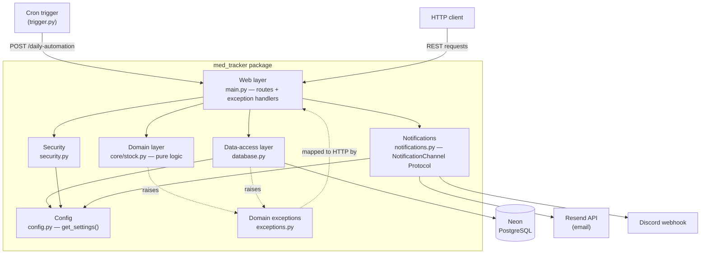

# 💊 Med Tracker API


> The Med-Tracker API is a microservice designed to track medication inventory and automatically send low-stock alerts via different channels (email, Discord).

## Features
* **Headless REST API:** Fully functional CRUD operations for tracking medications, dosages, and daily consumption.
* **Proactive Alerts:** Automated logic calculates `days_left` based on current stock and daily dosage.
* **Daily Automation:** A secure, token-protected `/daily-automation/` endpoint triggered by a cloud-native Cron Job.
* **Multi-Channel Notifications:** Alerts are broadcast via email (using the Resend HTTP API) and push notifications (via Discord Webhooks) when stock falls below the 14-day threshold.
* **Serverless Database:** Data is persisted using Neon PostgreSQL.
* **CI Workflow in GitHub Actions**: Completely automated CI workflow that verifies linting (`ruff`), type checks (`mypy`), and runs all unit and integration tests (`pytest`) upon pushes. PR requires green CI. 

## Architecture


- **Request Flow**: client or cron -> API route(s) -> domain decision -> data/notification action -> response
- **Dependency direction**: the web layer depends on everything; the domain core depends on nothing but the exceptions, which is what lets it be unit-tested with no database and no web server. 

##  Cloud Architecture
This project is deployed on **Render** using a dual-service architecture:

1. **Web Service (Docker)**: Runs the FastAPI application and connects to the Neon PostgreSQL database.
2. **Cron Job (Docker)**: A lightweight worker that wakes up daily. It executes trigger.py, which sends an authorized POST request to the Web Service to automatically deduct pills, calculate stock, and dispatch HTTP alerts to **Resend** and **Discord**.

## Tech Stack

* **Backend:** Python 3.12+, FastAPI, Pydantic
* **Database:** SQLModel (ORM), Neon Serverless PostgreSQL
* **Notifications:** Resend API (Email), Discord Webhooks (Push)
* **Package Management:** `uv`
* **Containerization:** Docker
* **Hosting:** Render (Web Service + Cron Job)

## Getting started

```
git clone https://github.com/amelendez-ds/med-tracker.git
cd med-tracker
uv sync
cp .env.example .env        # then fill in your values
uv run uvicorn med_tracker.main:app --reload
```

Open http://127.0.0.1:8000/docs for the interactive API.

## Running the tests
``uv run pytest``

24 tests (14 unit + 10 integration). Integration tests run against a throwaway
SQLite database created per-test, and the fixture neutralises all real
credentials — so the suite cannot touch production or send a real alert.


## Project Background

This project is a personal effort to practice software engineering principles and robust programming that would help me to move from "notebook-Data-Science" to Machine Learning engineering. 

For this purpose, I brainstormed an application that I (and others) would find useful. For context, I have several family members that require periodic medication prescription, and sometimes they forget to repeat the prescriptions in time, which results in skipped days while the meds arrive to the pharmacy.

 With Med-Tracker,  the user will get notifications via different channels (email, Discord) that their stock is low and they need to top-up. 

I selected the stack for their utility in a Machine Learning pipeline, but I created the app **without a Machine Learning component**. Instead of practicing training data processing, or training models, I wanted to **put that aside to focus on software engineering in Python**. 

I inventorised a list of concepts to practice:
- Project Structure and Software Arquitecture
- Linting and Typechecking
- Unit Testing via PyTest
- Error Handling
- Building REST API
- Databases (PostgreSQL)
- Containerisation via Docker
- Cloud deployment
- Automated Continuous Integration (CI)

In the way of working through each of these concepts, I discovered new ways of working with Python and GitHub. Some of the insights I gained are:

- A layered architecture divided in web / domain / data / security with a framework-free core.
- A ``NotificationChannel`` Protocol that allows for offline (py)testing.
- Customised Exceptions (Domain exceptions mapped to HTTP). 
- 24 tests (unit + integration), with isolated database tests.
- Full Working CI pipeline via GitHub Actions
- Automation via Cron Jobs

## Final Note: EU AI Act - Privacy & Risks
Med-Tracker is not an AI system. It performs **no** automated decision-making about people, and it is a deterministic inventory-and-alerting service, therefore it is a type of software that falls out of scope for High-Risk systems according to the EU AI Act (Regulation (EU) 2024/1689). Even so, the engineering standards upheld in this project (typed interfaces, separation of concerns, a tested and isolated notification path, credential isolation) are the same controls that Articles 10 and 15 require of AI systems that are high-risk. Since my software engineering efforts are aimed at the development of Machine Learning and AI systems, I thought it good practice to assess which parts of this learning project will overlap with requisites that I will be adding, according to our European regulation, to all my future ML projects. 